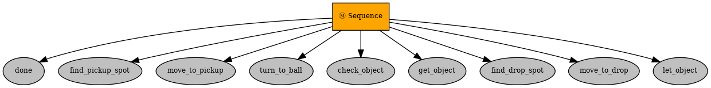
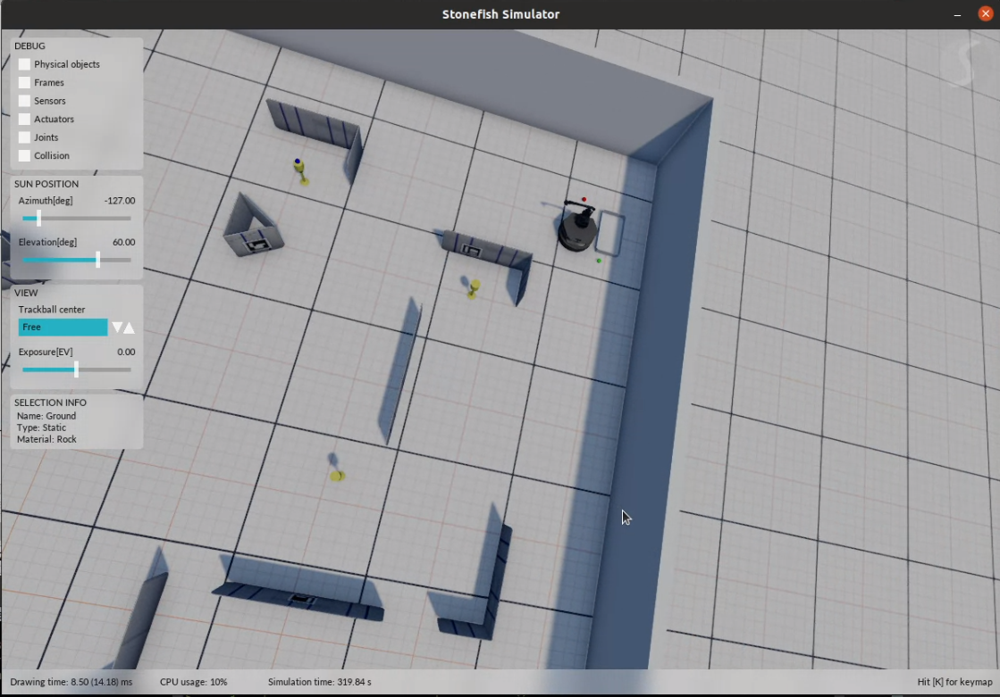
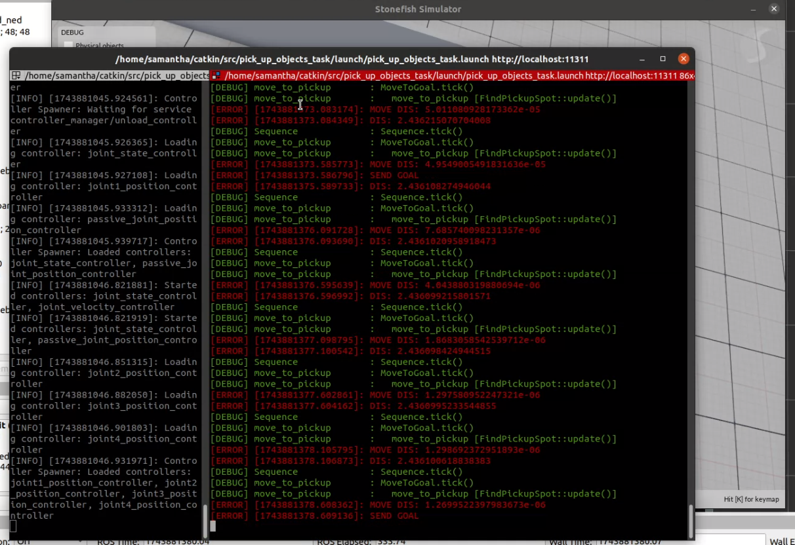
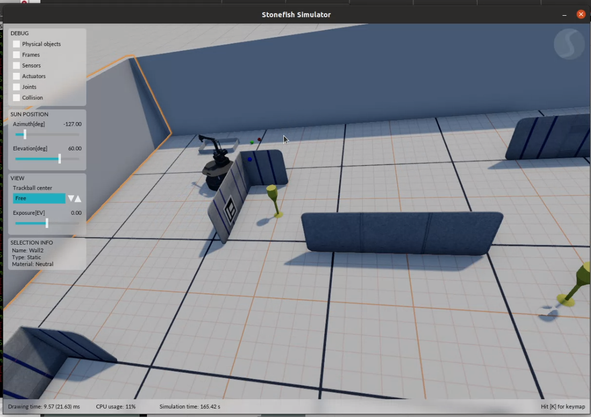
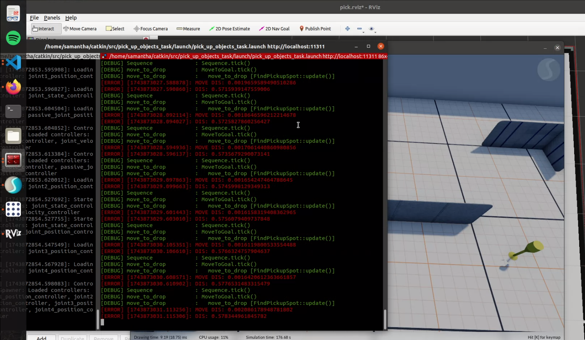

# Pickup Object Behavior Tree - HOPl ROS Package
(By Samantha Caballero)

## Required Packages
For this lab exercise , the python packages used in the `pickup_behaviors_node.py` are:

 * numpy as np
 * rospkg
 * py_trees
 * rospy
 * from std_srvs.srv import Trigger,TriggerRequest
 * from geometry_msgs.msg import PoseStamped
 * from nav_msgs.msg import Odometry
 * time
 * tf
 * math 
 * numpy
 * import rospy

## Running the Simulation

To run the simulation using the provided commands, follow these steps:

1. Launch the Stonefish Simulation + Octomap + Rviz:
   ```bash
   roslauch pick_up_object_task stonefish.lauch
   ```

2. In seperated terminal window, which executes the control tasks from the behaviour tree 
   ```bash
   run roslaunch pick_up_objects_task pick_up_objects_task.launch
   ```
    This command will execute the "controller" node responsible for the online path planning process.


## Overview

This ROS package implements a behaviour tree task planning algorithm for a robot using RRT path planning to move to a set of designated locations `(1.4, 0.7),(2.4, 3.15),(0.7, 2.5)`, detecting and picking an object and dropping it on a desired drop position `(-0.5, 3.5)`.  The set of actions is finished once the robot has either visited all the points or picked up both objects. The set of actions are described by a set of modules described below:


* `CheckObject` verifies if there is an object close to the Robot.
* `GetObject` performs the action of picking up the ball. 
* `LetObject` performs the action of leaving the ball.
* `MovetoGoal` moves the robot to the location where the /odom topic indicates (reading the blackboard), published by either the `FindDropSpot` or `FindPickupSpot` methods. 
* `FindPickupSpot` iterates through a sequence of predefined pickup locations, setting each as a goal in the blackboard and incrementing the pickup index counter until all positions have been visited.
* `TurnTowardsBall` rotates the robot to face toward a specific ball position
* `FindDropSpot` sets a fixed drop-off location as the goal in the blackboard, where the robot goes as the next goal to leave the picked up object (ball)
* `Done` monitors task completion status by tracking the pickup counter, terminating the behavior tree when all pickup locations have been processed

## Behaviour Tree 

The behavior tree implemented to solve the pick-up problem is shown in the figure below. The process begins by checking the finish condition using the behavior "done". If it's not met, the next child in the sequence, (FindPickupSpot), is executed. This sequence involves finding the pick-up spot, moving to it (MoveToGoal), and then turns to face the ball (TurnTowardsBall), verifies an object is present (CheckObject), picks it up (GetObject), identifies the drop-off location (FindDropSpot), moves to that position (MoveToGoal), and finally releases the object (LetObject). This sequence repeats until all three pickup locations have been processed, with each behavior reporting success or failure to determine flow control through the tree.

  

## Modifications 
### Online Planner

Instead of using the given basic planner, an online planner from previous lab was integrated in the workspace, used to avoid obstacles. RRT is used as a path planning algorithm to avoid obstacles and backtrack when the robot hits one. 


### Adjusted drop_position location
Instead of moving directly towards the object's positions, we define a pick-up position near the original position to avoid having a goal stuck in the object and make sure it is able to plan the path, otherwise it will be blocked and unable to move. 


The image below shows an example of this case, where the robot's next goal is the drop-off location, and the next step in the behavior tree is "LetObject", but since the ball is still too far from the goal for the robot to drop it and execute the "LetObject", the next actions cannot be yet ticked, so the program is stuck at this step. 

This is showcased by the following screenshots of the simulator used and the information log below:
    
    


### New Behavior - TurnTowardsBall
A new behavior had to be created to make the robot orientation face the target ball position after moving to it, and before grabbing the object. This ensured that the ball was placed only at the front of the robot so that when it moved towards the drop-off position facing forward, the ball would directly fall inside the designated area more easily. Otherwise, there were case scenarios where the robot would arrive to the drop-off position goal coming from the sides (not straight from the front), and drop the ball outside the designated area. This is because of how the 'GetObject' is programmed, by just using an "attach" functionality, so whenever the robot is close to the object and the GetObject behavior is ticked, the ball gets attached to any part of the robot. 

Another scenario is when the ball is attached somewhere other than the front of the robot, and when translating towards the drop-off position, the ball gets stuck at an obstacle, preventing the robot to continue to move, so it cannot reach the goal and the planner keeps detecting this as the next goal, but it cannot reach it so it gets stuck at the MoveToGoal (drop position) step and it can't continue. This is why the best solution was to make sure that the ball is placed at the front, where the robot path planner already planned a clear path for it to move. 

The image below shows an example of this case.   
    
    
    

### Changed distance threshold at Pickup Position 

Finally, there were scenarios where the robot approached one of the pick-up positions and could not attach the ball to itself, thus completing the GetObject task, and staying stuck at that step. This was solved by increasing the distance threshold (at 0.43m) to pick the ball in "handle_check_object" function. This meant that now it could reach the ball from a slightly further position, which was needed when the robot was not facing perfectly forward the ball and was being blocked by a certain obstacle from the side, and thus it could not grab the object. 

## Demo Videos 

Here I showcase the implementation and performance of the entire behavior tree, completing all tasks and finishing at the drop-off position:

[](https://www.youtube.com/watch?v=-JGClqArubw&t=15s)
